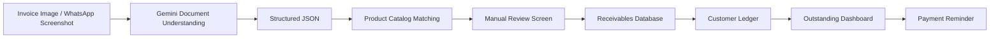

# Product Direction

> **Project:** AI Receivables Assistant for Pakistani FMCG Micro-Distributors
>
> **Version:** 1.0
>
> **Status:** MVP Definition
>
> **Owner:** Squad Bolan
>
> **Last Updated:** July 2026

---

# Table of Contents

1. Executive Summary
2. Product Vision
3. Product Evolution
4. Product Statement
5. Target Users
6. User Personas
7. User Journey
8. Current Workflow
9. Proposed Workflow
10. Product Principles
11. MVP Scope
12. AI Pipeline
13. Feature Prioritization
14. Technical Decisions
15. Out of Scope
16. Success Metrics
17. Future Roadmap
18. Open Questions

---

# Executive Summary

Our project originally started as an **AI Bookkeeping Assistant** capable of extracting invoice information and maintaining accounting records automatically.

During customer discovery, interviews with distributors, discussions with accounting professionals, ERP experts, and continuous mentor feedback revealed that bookkeeping was too broad for an 8-week MVP.

Instead, we identified a much more frequent and painful business problem:

> Small FMCG distributors struggle to keep track of customer receivables.

Business owners frequently ask questions like:

- Which customers still owe me money?
- Which invoices are overdue?
- Which customers have made partial payments?
- Who should I contact today?

The information required to answer these questions is usually scattered across paper invoices, WhatsApp chats, notebooks, Excel sheets, and manual ledgers.

Instead of replacing accounting software, our product focuses on solving this one validated workflow.

The final MVP is an AI-assisted receivables management application where distributors can upload invoices, verify AI-extracted information, maintain customer balances, and send payment reminders through a simple mobile interface.

---

# Product Vision

Build a simple AI-powered receivables assistant that helps Pakistani FMCG micro-distributors spend less time managing records and more time collecting payments.

The product should reduce repetitive manual work while keeping users fully in control of every financial record through mandatory human review.

---

# Product Evolution

## Initial Idea

AI Bookkeeping Assistant

↓

Extract invoices automatically

↓

Generate accounting records

↓

Maintain financial books

---

## Customer Discovery

After speaking with distributors and accountants we learned:

- bookkeeping is not the biggest daily pain
- receivables consume much more time
- payment follow-ups are manual
- users still verify every accounting entry

---

## Final Product Direction

Instead of building bookkeeping software, we decided to build a focused receivables assistant.

The product helps users:

- upload invoices
- organize receivables
- monitor outstanding balances
- record payments
- send reminders

---

# Product Statement

An AI-assisted bilingual (Urdu & English) mobile receivables assistant for Pakistani FMCG micro-distributors that converts invoice images and WhatsApp screenshots into structured receivable records after user verification.

The application maintains customer balances, highlights overdue invoices, supports partial payments, and simplifies payment follow-ups.

---

# Target User

| Attribute | Details |
|------------|----------|
| Primary User | Pakistani FMCG Micro-Distributor |
| Business Size | Small |
| Sales Model | Credit Sales |
| Team Size | 1–10 employees |
| Technology | Smartphone, WhatsApp, Paper Invoices |
| Main Goal | Collect payments faster |

---

# Out of Scope Users

The MVP does **not** target:

- Enterprise distributors
- Large ERP users
- Tax consultants
- Chartered accountants
- Inventory-heavy businesses
- Large manufacturers

---

# User Persona

## Ahmed

Age: 38

Business:
FMCG Micro Distributor

Daily Tasks

- Deliver products
- Create invoices
- Track customer balances
- Collect payments

Current Tools

- WhatsApp
- Paper invoices
- Notebook
- Excel

Pain Points

- Doesn't know who owes money.
- Searches old WhatsApp chats.
- Forgets payment due dates.
- Updates records multiple times.

Goals

- Spend less time updating records.
- Find outstanding balances instantly.
- Send reminders quickly.

---

# Current Workflow

```text
Credit Sale
        ↓
Invoice Created
        ↓
Paper Invoice / WhatsApp Screenshot
        ↓
Manual Record Keeping
        ↓
Customer Ledger
        ↓
Outstanding Tracking
        ↓
Phone Call / WhatsApp Reminder
        ↓
Payment Received
        ↓
Manual Balance Update
```

Problems with Current Workflow

| Problem | Business Impact |
|----------|----------------|
| Information scattered | Difficult to locate invoices |
| Duplicate entry | Wasted time |
| Manual reminders | Delayed collections |
| No dashboard | Poor visibility |
| Human error | Incorrect balances |

---

# Proposed MVP Workflow

```text
Credit Sale
        ↓
Invoice Generated
        ↓
Invoice Upload
(Camera / Gallery / WhatsApp)
        ↓
Gemini Document Understanding
        ↓
Extract Customer
Extract Products
Extract Amount
Extract Date
        ↓
Product Catalog Matching
        ↓
Manual Review Screen
        ↓
Receivable Saved
        ↓
Outstanding Dashboard Updated
        ↓
One-Tap WhatsApp Reminder
        ↓
Payment Recorded
```

---

# Product Principles

Our product follows five principles.

## 1. Solve One Problem Well

Instead of building an ERP system, focus on receivables.

---

## 2. Human First

AI prepares data.

Users approve data.

Financial information should never be automatically posted.

---

## 3. Mobile First

Our users already work from their phones.

The MVP should fit naturally into that workflow.

---

## 4. AI Assists

AI speeds up repetitive work.

It does not replace human decision making.

---

## 5. Validate Before Expanding

Every major feature should come from customer feedback rather than assumptions.
---

# AI Pipeline

The AI pipeline is designed to assist the user rather than automate financial decisions. Every extracted record passes through a human verification step before being stored.

## High-Level Pipeline



---

## Pipeline Explanation

| Stage | Description |
|---------|-------------|
| Invoice Upload | User uploads invoice through camera, gallery, PDF, or WhatsApp screenshot. |
| Gemini Extraction | Gemini extracts customer name, products, quantities, invoice amount, invoice date and payment terms. |
| Product Catalog Matching | Extracted products are matched against the distributor's own catalog to standardize names. |
| Manual Review | User reviews AI output before saving. |
| Database Storage | Confirmed data is stored. |
| Ledger Update | Customer balance is automatically updated. |
| Dashboard | Outstanding balances become visible. |
| Reminder | User can send payment reminders through WhatsApp. |

---

# Why Gemini?

After testing multiple invoices, Gemini demonstrated strong document understanding capabilities.

Instead of relying only on OCR, Gemini understands:

- handwritten notes
- mixed Urdu and English
- inconsistent invoice layouts
- contextual relationships
- missing fields

Gemini is therefore used as the primary document understanding model for the MVP.

---

# Why OCR Alone Is Not Enough

OCR extracts text.

Our product requires understanding.

For example,

OCR might produce:

```
Supreem
```

Gemini understands that this likely refers to

```
Supreme Flour
```

after matching it with the distributor's product catalog.

Similarly,

OCR reads text.

Gemini understands relationships between:

- customer
- products
- quantity
- invoice total
- payment terms

Therefore,

AI Document Understanding is preferred over traditional OCR-only pipelines.

---

# Product Catalog Strategy

Each distributor maintains a product catalog containing only the products they actually sell.

Example:

| Product Code | Product Name |
|---------------|----------------|
| F001 | Supreme Atta 10kg |
| F002 | Chakki Atta 20kg |
| F003 | Fine Flour 25kg |

During extraction,

Gemini produces

```
Supreem
```

The catalog matcher identifies

```
Supreme Atta 10kg
```

and presents it during review.

This improves consistency without requiring perfectly written invoices.

---

# Human Review

Financial data should never be posted automatically.

Instead,

every extracted invoice enters a review screen.

The user can

- edit customer name
- edit product names
- edit quantities
- edit prices
- approve
- reject

Only approved records are stored.

This approach increases trust and reduces financial risk.

---

# MVP Features

## Must Have

| Feature | Reason |
|----------|---------|
| Invoice Upload | Primary input method |
| Camera Capture | Quick document capture |
| WhatsApp Screenshot Upload | Matches current workflow |
| Gemini Extraction | AI document understanding |
| Manual Review | Required for financial accuracy |
| Customer Ledger | Core feature |
| Outstanding Dashboard | Shows receivables |
| Partial Payments | Common business workflow |
| Payment Reminder | Supports collections |

---

## Should Have

| Feature |
|------------|
| Product Catalog |
| Search |
| Customer History |
| Invoice History |
| Dashboard Filters |

---

## Could Have

| Feature |
|-------------|
| Analytics |
| AI Insights |
| Voice Input |
| Multi-user Accounts |
| Export Reports |

---

## Will Not Build (MVP)

The following features are intentionally excluded.

- Inventory Management
- ERP
- Payroll
- Tax Filing
- Profit & Loss Reports
- General Ledger
- Accounting Software
- Purchase Orders

These may be explored after validating the receivables workflow.

---

# Technical Decisions

| Decision | Reason |
|-------------|------------|
| Gemini | Better document understanding |
| Human Review | Improves trust |
| Product Catalog | Better product matching |
| Mobile First | Users already work from phones |
| WhatsApp Integration | Existing user behaviour |
| Receivables Focus | Smaller, validated MVP |

---

# Success Metrics

The MVP will be considered successful if it can demonstrate the following:

| Metric | Target |
|----------|---------|
| Invoice Upload Success | >95% |
| Required Field Extraction | High accuracy after review |
| Successful Reviews | Majority of invoices approved after minor edits |
| Reminder Usage | Users send reminders through app |
| Customer Adoption | Initial pilot users actively use workflow |

---

# Future Roadmap

## Phase 1 (Current MVP)

- Invoice Upload
- Gemini Extraction
- Manual Review
- Customer Ledger
- Outstanding Dashboard
- Payment Reminder

---

## Phase 2

- Better Product Matching
- Dashboard Analytics
- Customer Search
- Invoice Search
- Notification System

---

## Phase 3

- ERP Integration
- Inventory Module
- AI Business Insights
- Predictive Payment Collection
- Smart Credit Risk Analysis

---

# Risks

| Risk | Mitigation |
|----------|--------------|
| Handwritten invoices | Human review |
| Mixed Urdu & English | Gemini |
| Different invoice layouts | Prompt engineering + testing |
| Incorrect product names | Product catalog |
| User distrust | Manual verification |
| Poor OCR quality | Gemini contextual understanding |

---

# Open Questions

- What extraction accuracy is acceptable to users?
- How many invoice formats should the MVP support?
- Should product catalogs be uploaded manually or imported?
- How should duplicate invoices be detected?
- What is the best reminder schedule?

---

# Design Philosophy

This product is **not an accounting system**.

It is **not an ERP**.

It is **not a bookkeeping replacement**.

It is a focused receivables assistant designed to solve one validated problem exceptionally well.

Artificial Intelligence exists to reduce repetitive work—not remove the user from important financial decisions.

Every feature in the MVP contributes toward one goal:

> Helping Pakistani FMCG micro-distributors track outstanding payments more efficiently while keeping complete control over their financial records.

---

# References

This document was developed using:

- Customer interviews with Pakistani FMCG distributors
- Discussions with accounting professionals
- ERP expert feedback
- Internal mentor reviews
- OCR and Gemini feasibility experiments
- Product discovery research
- MVP planning sessions
